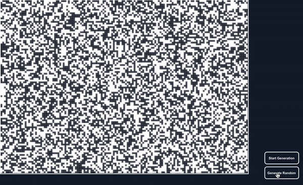

# John Conway's Game of Life
In recent times, I've become interested in the concept of cellular automata, more specifically, John Conway's, famous Game of Life (or just *Life*). In an effort to recreate
this wonderfully delightful simulation, I've employed the modern day processing power of Javascript and Canvas, however it was originally
invented using a Go board. But first, what are the rules to this simple game?

### The Rules

The rules are simple and straightforward. They go as follows:
1. **Survivals**. Every counter (or cell or block or whatever you wish to call it) with two or three neighboring counters survives for the next generation.
2. **Deaths**. Each counter with four or more neighbors dies (is removed) from overpopulation. Every
counter with one neighbor or none dies from isolation.
3. **Births**. Each empty cell adjacent to exactly three neighbors--no more, no fewer--is a birth cell. A
counter is placed on it at the next move.

These simple rules open up an infinite number of possible mutations and configurations.

 ### The Background
 
 *Life* was first recognized and popularized in the October 1970 edition of *The Scientific American*, written by Martin Gardner. In a recent video about *Life*, 
 John Conway himself describes how this first issue on his simple game became wildly popular. Here's how Gardner described the game
 >  This month we consider Conway's latest brainchild, a fantastic solitaire pastime he calls "life". Because of its analogies with the rise, fall and alternations of a society of living organisms, it belongs to a growingclass of what are called "simulation games"--games that resemble real-life processes (Gardner 3). 

According to Conway, the game was inspired by the work being done by John Von Neumann relating to colonization of planets. Von Neumann was working on theorizing about the 
*self-replicating space craft* (later named as the Von Neumann Probe). These self replicating machines would fulfill some predetermined task or purpose, however,
additionally, they would have the ability to manufacture themselves. Just how every single cell in one's body contains the full set of instructions for "building"
that person, so would these machines (defined as Turing Complete). Neumann's theories on self-replicating machines opened the door for a new interest. Cellular Automata.
This new phenomenon, intrigued Conway and lead to the development of *The Game of Life*.

## My Replica of the Game
My recent interest in *life* has lead me to attempt to replicate it in the form of a JS and Canvas web app. Below is a gif of the generator creating a random inital state. and runnning the game.

###### References
- <a href="https://www.youtube.com/watch?v=R9Plq-D1gEk">Numberphile Interview with John Conway</a>
- <a href="https://web.stanford.edu/class/sts145/Library/life.pdf">Martin Gardner's Article on *Life*</a>

###### Some Interesting Links relating to *Life*
- <a href="https://codegolf.stackexchange.com/questions/11880/build-a-working-game-of-tetris-in-conways-game-of-life/142673#142673">Working Tetris</a> 
- <a href="https://web.archive.org/web/20090910010855/http://conwaylife.com/soup/census.asp?rule=B3%2FS23&sl=1&os=1&ss=1">Census Results in Conway's Life</a>
- <a href="https://www.youtube.com/watch?v=Kk2MH9O4pXY">The Turing Completeness</a>
- <a href="https://www.youtube.com/watch?v=3NDAZ5g4EuU">Digital Clock</a>

